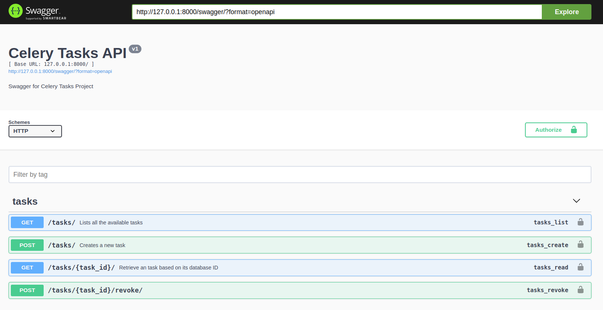

# Two Different Django Projects using a Shared Queue to Communicate (producer-consumer)

In this demo project, we are going to find a way to implement a mechanism in which two independent Django microservices
can communicate with each other.

## How to run

This project can be run using `docker` and `docker-compose`. Using `docker-compose.yml`
all the services configurations are set including service names, service images, volumes and so on. To run the project
execute

```shell
docker-compose --compatibility up 
```

We use `--compatibility` to enable running multiple instances of a single service without `docker swarm`.

After running the project, open your browser and navigate to `127.0.0.1:8000/swagger`:


To remove the existing docker containers just press `ctrl+c` and the run

```shell
docker-compose down
```
